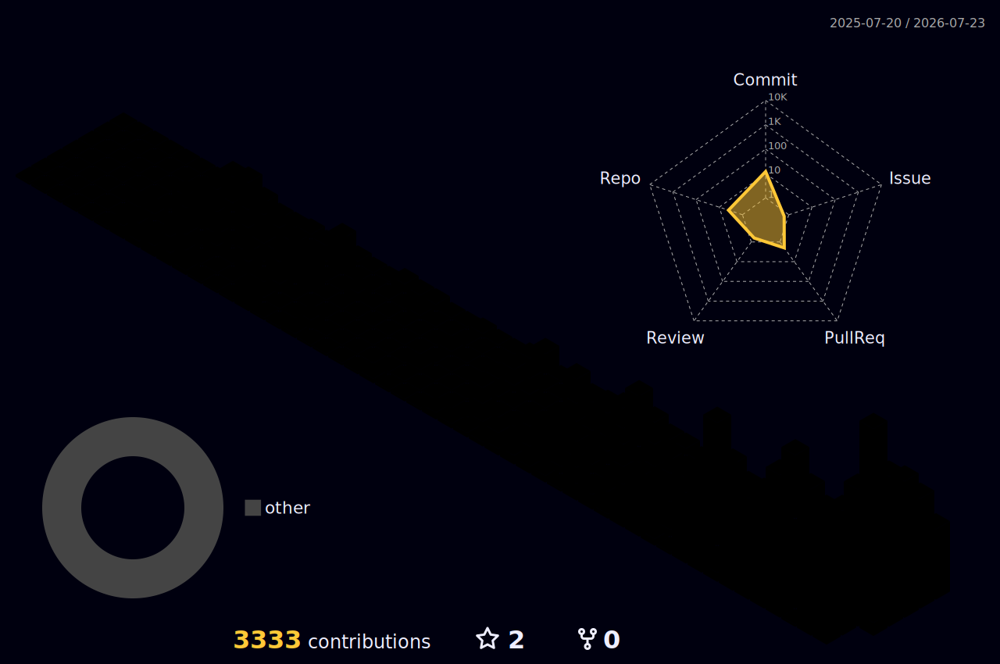

# Ahmed Fawzy

  <strong>Software Engineer interested in AI, automation, and scalable systems</strong>

  Building practical software at the intersection of AI, automation, and reliable developer infrastructure.

## Currently Building

### [FlawCue](https://flawcue.com)

I’m currently building FlawCue, my own product for turning recurring competitor complaints into sharper positioning, better product decisions, and practical growth opportunities.

## Selected Work

<table>
  <tr>
    <td width="50%" valign="top">
      <h3><a href="https://github.com/Ahmed-Fawzy-Coder/linux_mcp">linux_mcp</a></h3>
      
A token-efficient Linux MCP workspace gateway for Codex.

      <ul>
        <li>Bounded reads, searches, commands, and logs</li>
        <li>Background jobs and parallel execution</li>
        <li>systemd autostart and local telemetry</li>
      </ul>
    </td>
    <td width="50%" valign="top">
      <h3><a href="https://github.com/Ahmed-Fawzy-Coder/opencodex">opencodex</a></h3>
      
An OpenCodex fork with multi-provider routing and Linux MCP integration.

      <ul>
        <li>Connects Codex with multiple LLM providers</li>
        <li>Linux MCP savings telemetry</li>
        <li>Local-first workflows and always-on services</li>
      </ul>
    </td>
  </tr>
</table>

## Focus

AI · Automation · Developer Infrastructure · Local-First Software · Open Source · Scalable Systems

## Technologies & Tools

  

## 3D Contributions

  

## Contact

  

